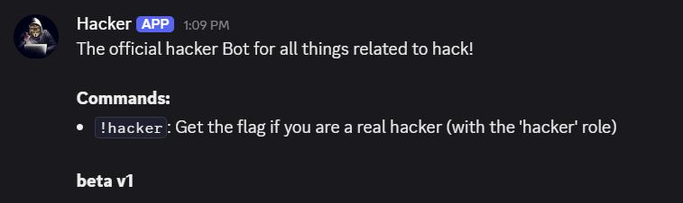
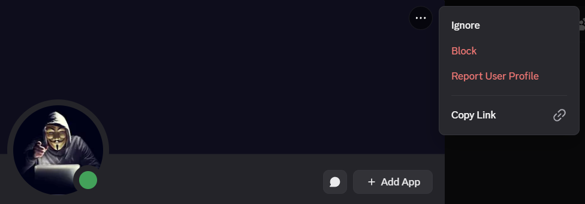
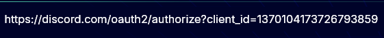
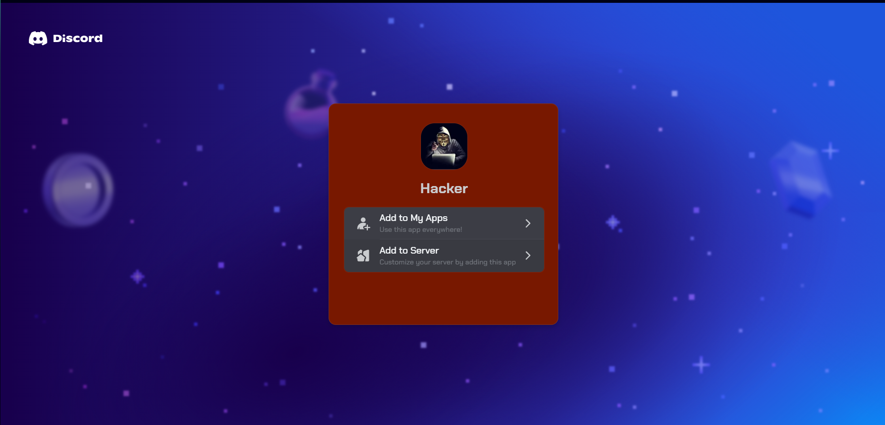
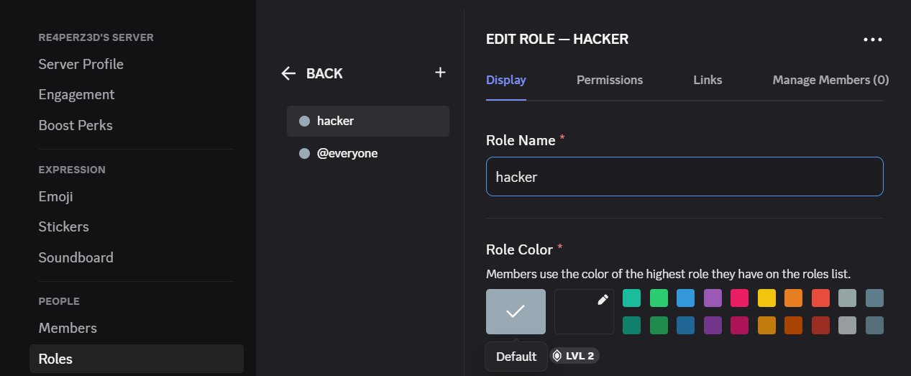
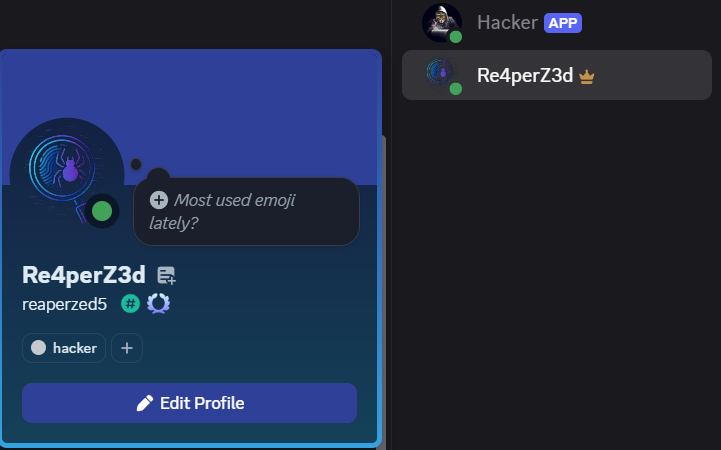
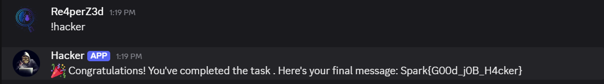

## Challenge Description

> "Check our Hacker Discord Bot"

This miscellaneous challenge focuses on understanding Discord bot logic and permissions. Participants must creatively manipulate bot behavior by simulating the required conditions.

---

## Solution Walkthrough

### 🤖 Step 1: Understand the Bot's Behavior

Upon joining the CTF’s official Discord server, you'll find a bot named `Hacker`. Typing the `!help` command reveals:



The key part is:

> “Get the flag if you are a real hacker (with the 'hacker' role)”

You don’t have administrative permissions in the original server, so you **can’t assign yourself** the `hacker` role there.

---

### 💡 Step 2: Creative Bypass – Simulate the Role

Since you can’t gain the role in the original server, the solution is to:

1. **Create your own Discord server**.
2. **Invite the bot** to your server.

   Read the guide here:  
   https://discordjs.guide/preparations/adding-your-bot-to-servers.html#bot-invite-links

   Use the bot invite URL format with the bot's client ID:

   ```text
   https://discord.com/api/oauth2/authorize?client_id=YOUR_BOT_ID&permissions=0&scope=bot%20applications.commands
   ```

   To find the bot's client ID:

   

   

   Paste the ID into the URL above and visit it to invite the bot:

   

3. In your server:
   - Create a role named `hacker`.

     

   - Assign the role to yourself.

     

4. Now type the command (e.g., `!flag`, or whatever the bot expects):

   

---

## 🏁 Flag

Spark{G00d_j0B_H4cker}

