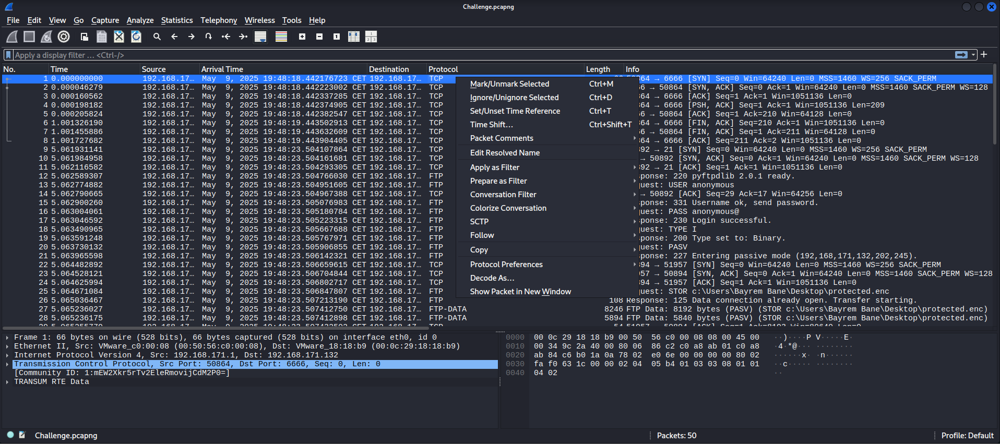
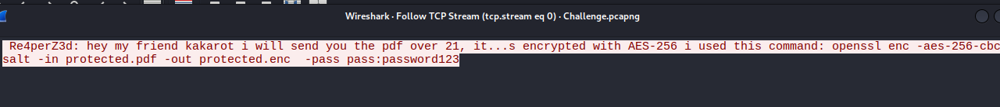
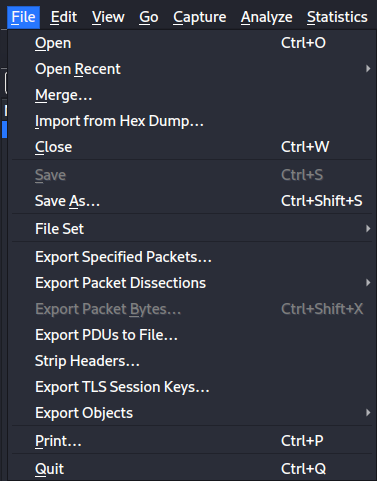
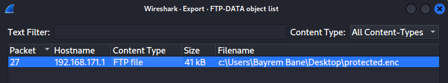
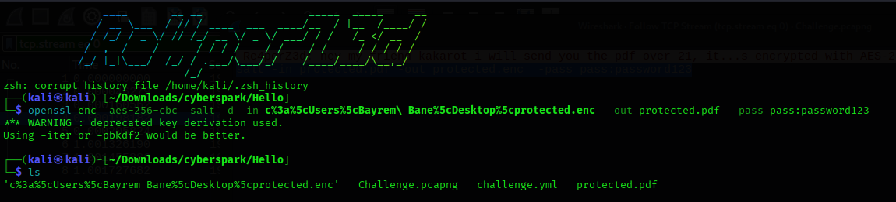
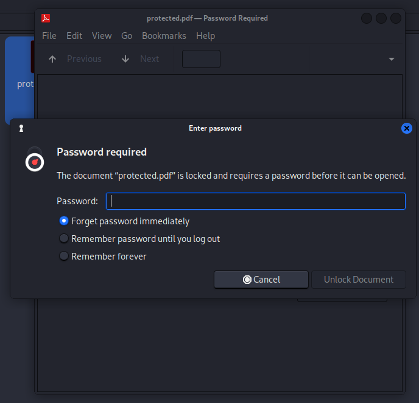
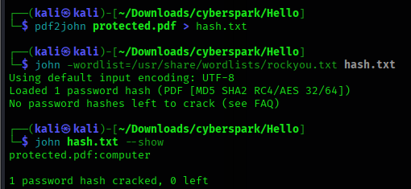
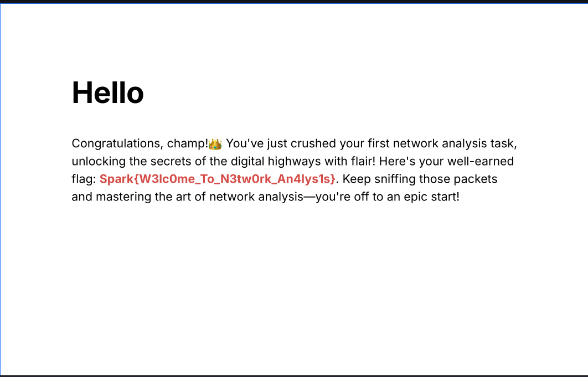

## Challenge Description

> "Oh no, I lost my PDF! But I remember having a conversation with my friend Kakarot — can you sniff it out?"

This challenge introduces participants to fundamental network forensics and password cracking. The goal is to recover an encrypted PDF shared over FTP and extract a hidden flag. Key skills include packet analysis, file extraction, AES decryption, and PDF password cracking.

---

## Solution Walkthrough

### 🧠 Step 1: Analyze the PCAP File

Open the provided `.pcap` file using **Wireshark**. Navigate to:



- `Analyze > Follow > TCP Stream`
- Choose **Stream 0**

Inside this stream, you’ll find a message:



```text
Re4perZ3d: hey my friend kakarot i will send you the pdf over 21, it...s encrypted with AES-256 i used this command: openssl enc -aes-256-cbc -salt -in protected.pdf -out protected.enc -pass pass:password123
```

This provides two hints:

- The PDF was transferred over **FTP** (`port 21`)
- It was encrypted using **AES-256-CBC** with `openssl`, using password: `password123`.

---

### 📦 Step 2: Export the Encrypted File

Go to:

- `File > Export Objects > FTP`



- Locate and export the file named something like `protected.enc`

Save it locally.



---

### 🔐 Step 3: Decrypt the File

Use the decryption command (as hinted in the chat):

```bash
openssl enc -aes-256-cbc -salt -d -in protected.enc -out protected.pdf -pass pass:password123
```



You’ll get a file named `protected.pdf`, but it’s **still password-protected**.



---

### 🔓 Step 4: Crack the PDF Password

Now, we’ll use **John the Ripper** to crack the PDF's password.

**Convert the PDF to a crackable hash:**

```bash
pdf2john protected.pdf > hash.txt
```

**Crack the hash using a wordlist (like rockyou):**

```bash
john -wordlist=/usr/share/wordlists/rockyou.txt hash.txt
```

**To see the recovered password:**

```bash
john hash.txt --show
```

Output:

```text
protected.pdf:computer
```

The password is: `computer`



---

### 📖 Step 5: Open the PDF and Retrieve the Flag

Open `protected.pdf` using the password `computer`.



Inside, you’ll find the flag:

```text
Spark{W3lc0me_To_N3tw0rk_An4lys1s}
```

---

## 🏁 Flag

```text
Spark{W3lc0me_To_N3tw0rk_An4lys1s}
```

---

## 📚 Skills Learned

- 📡 **Network Traffic Analysis**: Following TCP streams to uncover conversations and hints in captured packets.
- 📁 **FTP File Extraction**: Using Wireshark to export transferred files through FTP.
- 🔐 **AES Decryption**: Understanding symmetric encryption using OpenSSL and how to decrypt with a known password.
- 🪪 **Password Cracking**: Applying tools like `pdf2john` and `john` to crack password-protected PDF files.
- 🔍 **Forensic Investigation Workflow**: Combining multiple tools and techniques to investigate, extract, decrypt, and crack protected content from network captures.
