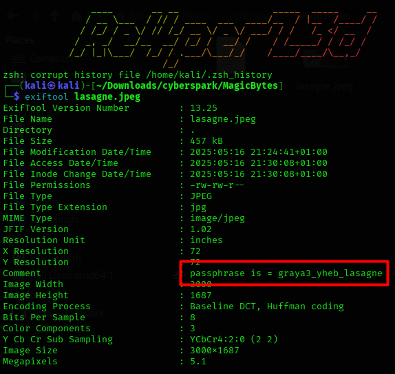
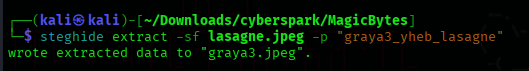
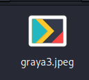
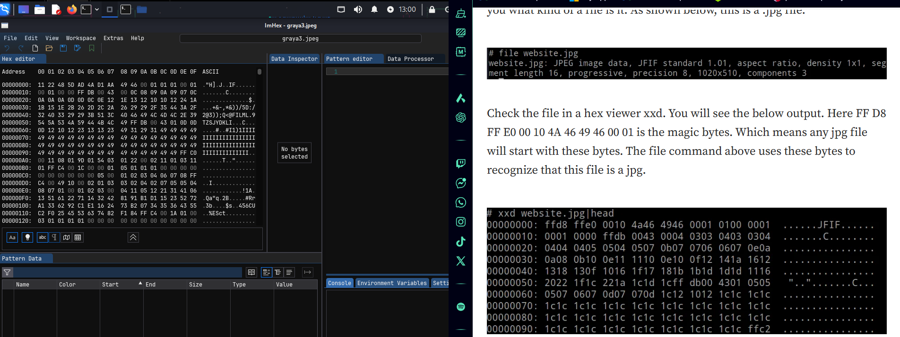

## Challenge Description

> "My friend gray3 loves lasagne."

This miscellaneous challenge focuses on basic **steganography** and **file repair** techniques. Participants must analyze image metadata, extract embedded content, and fix a corrupted JPEG to reveal the final flag.

---

## Solution Walkthrough

### 🔍 Step 1: Check the Metadata

Start by examining the metadata of the provided image using `exiftool`:



Among the usual metadata, you'll notice a comment:

```
Comment        : passphrase= graya3_yheb_lasagne
```

This is a strong hint that **Steghide** was used to embed data, and the provided phrase is the **passphrase**.

---

### 🗂️ Step 2: Extract the Hidden File with Steghide

Use `steghide` to extract hidden data from the image using the discovered passphrase:

```bash
steghide extract -sf image.jpg
```



---

### 🧩 Step 3: Fix the Corrupted JPEG Header

The extracted image is corrupted due to a **damaged JPEG header**. To fix this:



Steps:

1. Open `corrupted.jpg` in a **hex editor** (e.g., `HxD`, `hexeditor`, `imhex`, or the online tool [hexed.it](https://hexed.it)).
2. Compare it with a valid JPEG header (e.g., from another working JPEG):

   

3. Replace the incorrect header bytes with a valid JPEG header.

A typical JPEG file begins with:

```
FF D8 FF E0 ...
